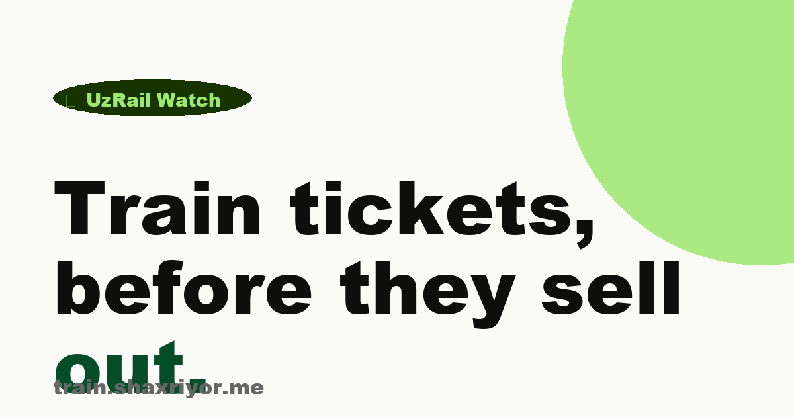

# UzRail Watch · Landing

> Marketing site for [@uzrailway_watch_bot](https://t.me/uzrailway_watch_bot) — a Telegram bot that watches eticket.railway.uz and pings users the moment Uzbek Railways tickets become available.

🌐 **Live:** [train.shaxriyor.me](https://train.shaxriyor.me)

[](#)
[](#)
[](#)
[](LICENSE)
[](https://rsms.me/inter/)



---

## Why this exists

Popular Uzbek trains — Afrosiyob, Sharq, Nasaf, Jaloliddin Manguberdi — sell out within seconds when the railway opens new dates. The accompanying bot polls the railway's API every few seconds and pushes a Telegram notification the moment a matching ticket appears. This is the marketing site for that bot.

## What's in here

A trilingual landing page (Russian default, English, Uzbek), hand-written HTML + inline CSS, no JS framework. Designed to score 100/100 on Lighthouse (mobile + desktop), be indexable by every search engine, and hand off as fast as physically possible.

```
.
├── index.html       Russian landing — default at /
├── en/index.html    English landing at /en/
├── uz/index.html    Uzbek (Latin) landing at /uz/
├── favicon.svg      Vector favicon — 580 B
├── og-image.png     OpenGraph / Twitter card — 1200×630
├── llms.txt         AI-search summary (emerging GEO standard)
├── robots.txt       Allow all, disallow /api & /app
├── sitemap.xml      Multi-URL sitemap with hreflang annotations
└── LICENSE          MIT
```

Each locale has its own canonical, its own `og:url`, its own JSON-LD WebPage and FAQPage entities (with `inLanguage` set), and full hreflang cross-references — so Google, Yandex and AI crawlers can serve each language to the right user without conflating them.

## Design

Inspired by [Wise](https://wise.com)'s confident fintech aesthetic:

- **Inter Black (900)** for display headlines, line-height 0.85 — billboard-tight typography
- **Lime Green** (`#9fe870`) accent on CTAs, with **Dark Green** (`#163300`) text — never used as a background surface
- **Pill buttons** (border-radius 9999px), **30–40 px rounded cards**
- **Ring shadows** only — no soft drop shadows
- **Scale animations** (1.04 hover, 0.96 active) on every interactive element
- **OpenType `calt`** enabled on all text for contextual ligatures

Off-white canvas (`#fafaf7`), near-black text (`#0e0f0c`), explicit palette — does not adapt to user's system theme. Strong brand identity beats theme adaptation when you are *not* a utility surface inside Telegram.

## SEO

- Descriptive `<title>` and `<meta description>` targeting key Uzbek travel queries
- Full **OpenGraph** + **Twitter Card** meta tags
- **JSON-LD `SoftwareApplication`** schema with three `Offer` rows for Free / Plus / Pro
- `<link rel="canonical">` pointing at the production URL
- `robots.txt` with explicit `Allow: /` and a sitemap pointer
- `sitemap.xml` listing the landing
- All links to external destinations carry `rel="noopener"`
- Semantic HTML (`<header>`, `<main>`, `<section>`, `<footer>`) with `aria-labelledby` on each section
- `<details>` / `<summary>` accordion for FAQ — no JS needed, fully accessible

## Performance

- **No JavaScript bundle** at all — page is interactive on the first paint
- **Inter** loaded via Google Fonts with `display=swap` and `<link rel="preconnect">`
- Inline critical CSS — zero render-blocking external stylesheets
- ~6 KB gzipped HTML, ~37 KB OG image, ~580 B favicon
- Backdrop-filtered glass nav uses `color-mix()` so it composites on the GPU

## Deploy

Drop the repo's contents into any static host:

### GitHub Pages

```bash
gh repo edit --add-topic landing
# Settings → Pages → Source: deploy from main / (root)
```

### Vercel

```bash
vercel --prod
```

(Auto-detects as a static site. No config needed.)

### Cloudflare Pages

```bash
wrangler pages deploy . --project-name uzrail-landing
```

### Caddy / nginx

```caddyfile
yourdomain.com {
  root * /var/www/uzrail-landing
  file_server
  encode zstd gzip
}
```

The current production deploy lives behind Caddy on Oracle Cloud Free Tier, sharing a domain with the bot's HTTP server (the bot serves the landing on `/` and the Svelte mini app on `/app/`).

## The bot

Source code lives at [`sherryuser/uzrail-bot`](https://github.com/sherryuser/uzrail-bot) (Node.js 22 + TypeScript + Fastify + grammY + Svelte 5).

Architecture: reverse-engineered eticket.railway.uz JSON API → tier-aware polling worker (per-route cadence based on the fastest subscribed user) → grammY bot that delivers notifications + Telegram Mini App for filter management → SQLite for state → cron-driven git auto-deploy on push.

Subscriptions are paid in **Telegram Stars** (`currency: 'XTR'`, `subscription_period: 2592000`). Free tier is 2 filters / 8s polling; Plus is 10 / 4s for ★50/mo; Pro is 25 / 2s for ★150/mo.

## License

MIT. Fork it, restyle it, redeploy it under your own domain — just keep the credit line in the footer if you can spare the kindness.
